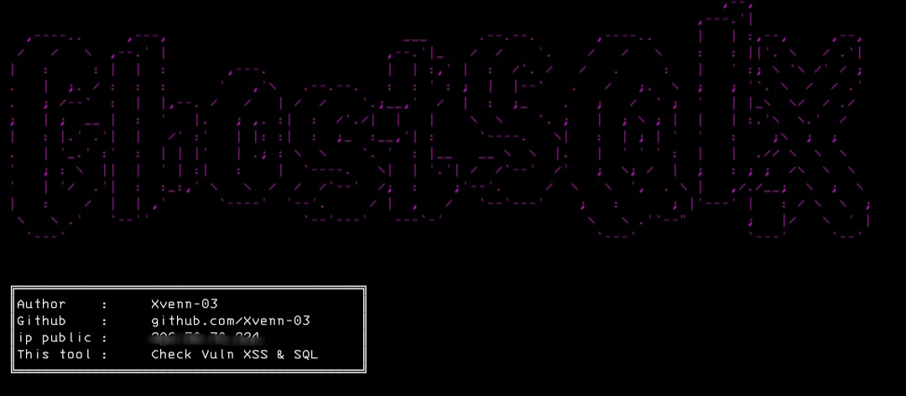

# GhostSQLX

GhostSQLX is a tool that searches for vulnerabilities in websites such as xss and sql vulnerabilities and this script will also search for open ports on the website. 

## The features in the script include: 
- Looking for SQL vuln.
- Looking for XSS vuln.
- Looking for Open port.

## Instalations
Dont recode my script.
```
$ apt update -y && apt upgrade -y
$ pkg install git
$ pkg install python -y
$ git clone https://github.com/Xvenn-03/GhostSQLX
$ cd GhostSQLX
$ python3 Vuln.py
```
## There is a problem?
If you have any problems or errors please contact me from gmail below
[](mailto:xynnxploit941@gmail.com) 

### Visitors :

